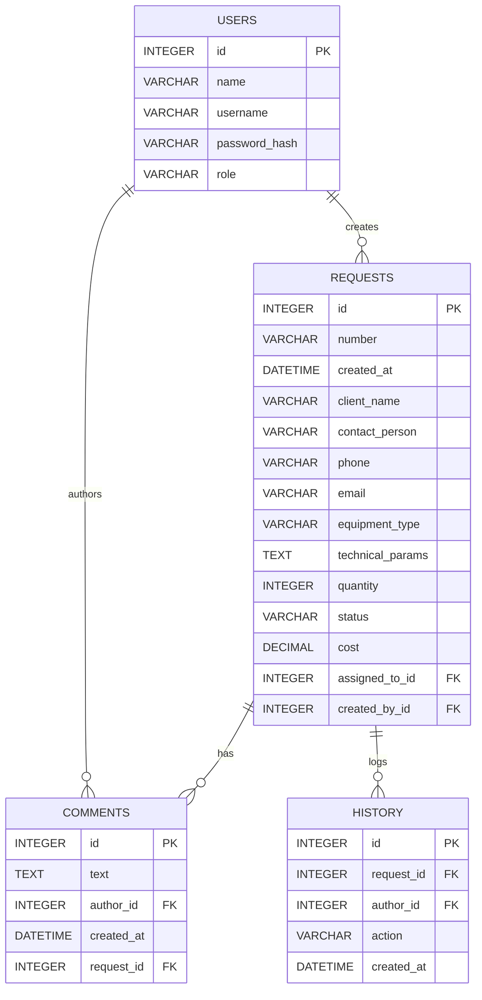

# ALIMP Requests — Система управления заявками на оборудование РЗА

Короткое описание
Система для внутреннего использования отдела продаж и техподдержки НПП «АЛИМП»: регистрация клиентских заявок, подбор оборудования, формирование коммерческих предложений и отгрузка.

Стек технологий
- Python 3.11+
- FastAPI
- SQLite
- SQLAlchemy (ORM)
- Jinja2 (шаблоны)
- Uvicorn (ASGI)

Функции
- Три роли: Manager (менеджер), Engineer (инженер), Admin (администратор)
- Создание/редактирование заявок, статусы, назначение инженера
- Комментарии и история действий
- Управление пользователями (админ)
- Простой отчет по статусам и суммам

Тестовые учетки (по умолчанию создаются при первом запуске)
- manager / man123 (Менеджер)
- engineer / eng123 (Инженер)
- admin / admin123 (Администратор)

ER-диаграмма (Mermaid)


Структура проекта (важные файлы)
- main.py — точка входа приложения
- config.py — настройки, справочники
- database.py — подключение SQLAlchemy
- models.py — ORM модели
- templates/ — Jinja2 шаблоны (base.html, login.html, requests_list.html, request_detail.html,...)
- routers/ — роутеры: auth, requests, users, reports
- static/css/styles.css — стили
- requirements.txt
- .gitignore

Запуск локально (Windows, PowerShell)

1) Перейти в папку проекта:
```
cd "C:\Users\Vlad\Desktop\ALIMP"
```
2) Создать и активировать виртуальное окружение:
```
python -m venv .venv
.\\.venv\\Scripts\\Activate
```
3) Установить зависимости:
```
pip install -r requirements.txt
```
4) Запустить приложение:
```
uvicorn main:app --reload --host 127.0.0.1 --port 8000
```

Доступ: http://127.0.0.1:8000

Тестовые учётки: manager/man123, engineer/eng123, admin/admin123

Примечания
- Измените SECRET_KEY и пароли перед публикацией.
- Проверьте права доступа пользователей в коде (init_users в main.py).

Use Case (Mermaid)
```mermaid
%%{init: {'theme':'default'}}%%
usecaseDiagram
  actor Manager
  actor Engineer
  actor Admin

  Manager --> (Войти в систему)
  Manager --> (Создать заявку)
  Manager --> (Закрыть заявку)
  Engineer --> (Взять заявку в работу)
  Engineer --> (Перевести в статус "Выполнено")
  Engineer --> (Добавить комментарий)
  Manager --> (Просмотреть список заявок)
  Engineer --> (Просмотреть список заявок)
  Manager --> (Просмотреть историю заявки)
  Engineer --> (Просмотреть историю заявки)
  Admin --> (Управлять сотрудниками)
  Admin --> (Сменить пароль сотруднику)
  Admin --> (Удалить сотрудника)

  (Создать заявку) .> (Войти в систему) : extends
  (Закрыть заявку) .> (Войти в систему) : extends
  (Взять заявку в работу) .> (Войти в систему) : extends
```
